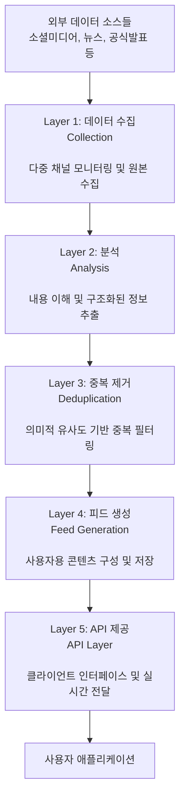
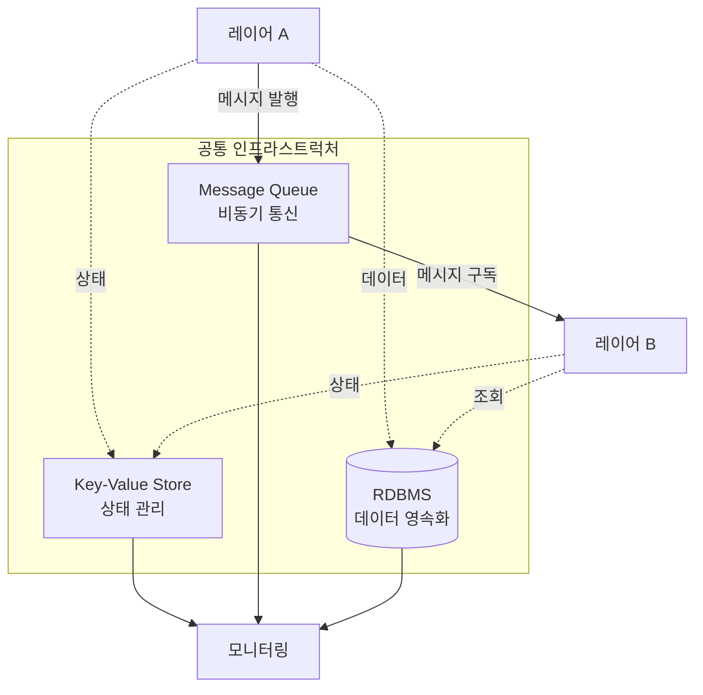

# 데이터 처리 파이프라인 설계

## 1. 서비스 개요

### 1.1 목적
트럼프 대통령의 발언을 실시간으로 수집하고, 한국 경제와 시장에 미치는 영향을 분석하여 일반 투자자들에게 신속하게 제공하는 서비스

### 1.2 핵심 가치
- **신속성**: 발언 발생 후 수 분 내 정보 제공
- **정확성**: 검증된 채널과 중복 제거를 통한 신뢰성 확보
- **접근성**: 언어 장벽 제거 및 맥락 제공

---

## 2. 시스템 아키텍처

### 2.1 레이어 구조

시스템은 5개의 독립적인 레이어로 구성되며, 각 레이어는 명확한 책임과 인터페이스를 가집니다.



### 2.2 각 레이어 요약

| 레이어 | 핵심 책임 | 입력 | 출력 |
|--------|-----------|------|------|
| **수집** | 여러 채널에서 트럼프 발언을 모니터링하고 수집 | 외부 데이터 소스 | 구조화된 원본 데이터 |
| **분석** | 수집된 내용을 이해하고 핵심 정보 추출 | 원본 데이터 | 분석된 정보 (요약, 분류) |
| **중복 제거** | 여러 채널에서 온 동일/유사 내용 필터링 | 분석된 정보 | 유일한 콘텐츠만 |
| **피드 생성** | 사용자에게 제공할 최종 형태로 구성 | 검증된 분석 정보 | 완성된 피드 항목 |
| **API** | 클라이언트에 데이터 제공 및 실시간 알림 | 피드 요청 | 피드 데이터, 알림 |

---

## 3. 공통 인프라스트럭처



### 3.1 레이어 간 통신 (Message Queue)

#### 3.1.1 통신 방식

각 레이어는 비동기 메시지 기반으로 통신하여 독립성과 확장성을 보장합니다. 한 레이어가 처리를 완료하면 메시지를 발행하고, 다음 레이어가 이를 구독하여 처리를 이어갑니다.

#### 3.1.2 메시지 계약

##### 수집 → 분석
- **발행 시점**: 새로운 데이터 수집 완료 시
- **핵심 내용**: 원본 데이터 식별자, 전체 내용, 채널 정보, 발생 시각
- **보장사항**: 중복 수집 방지 완료, 원본 데이터 저장 완료

##### 분석 → 중복 제거
- **발행 시점**: 분석 처리 완료 시
- **핵심 내용**: 분석 결과 식별자, 의미 요약, 표시용 요약, 분류 정보
- **보장사항**: 모든 분석 항목 생성 완료, 분석 결과 저장 완료

##### 중복 제거 → 피드 생성
- **발행 시점**: 중복이 아닌 것으로 판정 시
- **핵심 내용**: 검증된 분석 정보 전체
- **보장사항**: 유사도 검증 완료, 최근 시간 내 중복 없음 확인

##### 피드 생성 → API
- **발행 시점**: 피드 항목 생성 완료 시
- **핵심 내용**: 새 피드 항목 식별자
- **보장사항**: 피드 데이터 저장 완료, 조회 가능 상태

#### 3.1.3 실패 처리 원칙

- **재시도 가능한 실패**: 일시적 오류는 지수 백오프로 재시도
- **재시도 불가능한 실패**: 영구 오류는 별도 처리 경로로 이동
- **격리**: 한 레이어의 실패가 다른 레이어에 영향을 주지 않음

### 3.2 데이터 저장소 (RDBMS)

#### 3.2.1 역할

원본 데이터와 각 레이어의 처리 결과를 영속화하는 중앙 저장소입니다. 모든 레이어가 공유하며 데이터의 무결성과 일관성을 보장합니다.

#### 3.2.2 주요 테이블

| 테이블 | 용도 | 보존 기간 |
|--------|------|-----------|
| `raw_data` | 수집된 원본 데이터 | 영구 |
| `analysis_results` | 분석 결과 | 영구 |
| `feed_items` | 생성된 피드 | 정책에 따름 |
| `audit_log` | 감사 로그 | 1년 |

#### 3.2.3 접근 원칙

- 각 레이어는 자신이 생성한 데이터에 대해서만 쓰기 권한 보유
- 다른 레이어의 데이터는 읽기 전용으로 접근
- 트랜잭션 보장으로 데이터 무결성 유지
- 동시성 제어를 통한 데이터 일관성 확보

### 3.3 상태 관리 (Key-Value Store)

#### 3.3.1 네임스페이스 설계

각 레이어와 기능별로 독립적인 네임스페이스를 사용하여 상태 정보를 격리하고 관리합니다.

| 네임스페이스 | 용도 | 예시 키 |
|------------|------|---------|
| `collection:*` | 수집 레이어 상태 | `collection:checkpoint:twitter`, `collection:status:truthsocial` |
| `analysis:*` | 분석 레이어 상태 | `analysis:processing:item123`, `analysis:llm:usage` |
| `dedup:*` | 중복제거 레이어 상태 | `dedup:cache:hash`, `dedup:status` |
| `feed:*` | 피드생성 레이어 상태 | `feed:status`, `feed:last_generated` |
| `api:*` | API 레이어 상태 | `api:connections`, `api:rate_limit` |
| `pipeline:*` | 전체 파이프라인 추적 | `pipeline:item:123:status`, `pipeline:item:123:history` |
| `metrics:*` | 통합 메트릭 | `metrics:daily:2024-01-01`, `metrics:hourly:throughput` |

#### 3.3.2 상태 관리 계약

**각 레이어의 책임**
- 자신의 네임스페이스 내에서만 쓰기 작업 수행
- 다른 레이어의 네임스페이스는 읽기 전용으로 접근
- 처리 시작/완료/실패 시 즉시 상태 업데이트
- 주기적으로 하트비트 신호 전송 (30초 간격)

**공통 상태 필드**

모든 레이어는 다음의 공통 상태 정보를 유지합니다:
- **status**: 현재 상태 (idle, processing, error, stopped)
- **last_updated**: 마지막 업데이트 시각
- **items_processed**: 처리된 항목 수
- **error_count**: 누적 에러 횟수
- **consecutive_errors**: 연속 에러 횟수
- **checkpoint**: 마지막 처리 위치 정보
- **health**: 하트비트, 리소스 사용량 등 건강도 지표

#### 3.3.3 상태 전이 추적

파이프라인을 통과하는 각 데이터 항목의 진행 상황을 추적합니다. 항목이 각 레이어에 진입하고 나가는 시점, 처리 시간, 상태 변화를 기록하여 전체 처리 과정을 모니터링할 수 있습니다.

**추적 정보**
- 현재 처리 중인 레이어
- 각 레이어별 진입/완료 시각
- 레이어별 처리 소요 시간
- 처리 상태 (성공/실패/재시도)

#### 3.3.4 모니터링 활용

상태 관리 시스템을 통해 실시간으로 파이프라인 전체의 건강도를 모니터링합니다.

**주요 모니터링 지표**
- 전체 파이프라인 상태 조회
- 레이어별 처리 현황 및 성능
- 레이어 간 처리 지연시간
- End-to-End 처리 시간
- 에러 발생 패턴 및 빈도

**실시간 대시보드 구성**
- **Overview**: 전체 레이어 상태 한눈에 보기
- **Layer Details**: 각 레이어별 상세 메트릭
- **Pipeline Flow**: 데이터 흐름 시각화
- **Alerts**: 임계값 초과 시 알림


---

## 4. 시스템 요구사항

### 4.1 기능 요구사항

**필수 기능**
- 다중 채널 동시 모니터링
- 실시간 데이터 수집 및 처리
- 의미 기반 중복 제거
- 산업별 분류 및 태깅
- 시간순 피드 제공
- 실시간 업데이트
- 중앙 상태 관리 및 모니터링

**확장 기능**
- 채널 동적 추가/제거
- 사용자 맞춤 필터링
- 과거 데이터 검색
- 통계 및 분석 리포트
- 예측 알림

### 4.2 비기능 요구사항

**성능**
- 발언 발생 후 5분 이내 피드 생성
- 동시 다중 채널 처리 (10개 이상)
- 초당 최소 10건 이상 처리 능력
- 상태 조회 응답시간 < 10ms

**신뢰성**
- 99.9% 가용성 목표
- 데이터 손실 방지
- 장애 시 자동 복구
- 상태 정보 이중화

**확장성**
- 수평 확장 가능한 구조
- 채널 추가 시 기존 시스템 영향 없음
- 처리량 증가에 따른 동적 스케일링
- 상태 저장소 샤딩 지원

**보안**
- 외부 API 인증 관리
- 민감 정보 암호화
- 접근 권한 관리
- 상태 정보 접근 제어

---

## 5. 데이터 흐름

### 5.1 정상 처리 흐름

```
1. [수집] 채널 모니터링 → 새 발언 감지 → 원본 저장 → 상태 업데이트 → 메시지 발행
           ↓
2. [분석] 메시지 수신 → 상태 업데이트 → 내용 분석 → 요약 생성 → 분류 → 저장 → 상태 업데이트 → 메시지 발행
           ↓
3. [중복제거] 메시지 수신 → 상태 업데이트 → 유사도 계산 → 중복 판정 → (통과 시) 상태 업데이트 → 메시지 발행
           ↓
4. [피드생성] 메시지 수신 → 상태 업데이트 → 피드 구성 → 저장 → 상태 업데이트 → 알림 메시지 발행
           ↓
5. [API] 알림 수신 → 상태 업데이트 → 실시간 전송 / 피드 요청 → 데이터 조회 → 응답
```

### 5.2 처리 시간 목표

| 단계 | 목표 시간 | 최대 허용 시간 |
|------|-----------|----------------|
| 수집 | 30초 이내 | 1분 |
| 분석 | 30초 이내 | 1분 |
| 중복 제거 | 5초 이내 | 10초 |
| 피드 생성 | 5초 이내 | 10초 |
| API 응답 | 100ms 이내 | 500ms |
| 상태 업데이트 | 10ms 이내 | 50ms |
| **전체** | **2분 이내** | **5분** |

---

## 6. 데이터 모델

### 6.1 핵심 엔티티

각 레이어는 독립적인 데이터 모델을 가지며, 레이어 간에는 메시지를 통해서만 데이터를 교환합니다.

| 레이어   | 주요 데이터        | 용도             |
|-------|---------------|----------------|
| 수집    | 원본 데이터, 수집 상태 | 재처리, 감사, 상태 추적 |
| 분석    | 분석 결과, 처리 상태 | 요약, 분류 정보 보관, 진행 추적 |
| 중복 제거 | 의미 벡터, 유사도 이력, 캐시 상태 | 유사도 비교, 추적, 성능 모니터링 |
| 피드 생성 | 피드 항목, 생성 상태 | 사용자 제공용 최종 데이터, 배포 추적 |
| API   | 캐시, 세션, 연결 상태 | 성능 최적화, 연결 관리, 부하 모니터링 |

### 6.2 데이터 생명주기

- **원본 데이터**: 영구 보존 (규정 준수 및 재분석용)
- **분석 결과**: 영구 보존 (서비스 개선 및 통계용)
- **의미 벡터**: 24-48시간 (중복 비교 윈도우)
- **피드 데이터**: 서비스 정책에 따라 보존
- **상태 데이터**: 7-30일 (모니터링 및 디버깅용)
- **메트릭 데이터**: 90일 (성능 분석용)
- **캐시**: 단기 보존 (성능 최적화용)

---

## 7. 운영 고려사항

### 7.1 모니터링 지표

#### 7.1.1 시스템 건강도
- 각 레이어 가동 상태 (상태 관리 시스템에서 실시간 조회)
- 메시지 큐 크기 및 처리 속도
- 에러율 및 재시도 횟수
- 레이어별 하트비트 상태

#### 7.1.2 비즈니스 지표
- 수집된 발언 수
- 생성된 피드 수
- 중복 제거율
- 평균 처리 시간
- End-to-End 지연시간

#### 7.1.3 상태 기반 알림

**주요 알림 조건**
- **레이어 다운**: 하트비트가 60초 이상 없을 때 (Critical)
- **처리 지연**: 처리 시간이 임계값을 초과할 때 (Warning)
- **연속 에러**: 연속 에러가 5회 이상 발생할 때 (Critical)
- **리소스 부족**: CPU/메모리 사용률이 90% 초과 (Warning)

### 7.2 장애 대응

#### 7.2.1 자동 복구
- 레이어별 독립적 재시작
- 메시지 재처리
- 체크포인트 기반 복구 (상태 관리 시스템에서 조회)
- Circuit Breaker 패턴 적용

#### 7.2.2 수동 개입 필요 상황
- 외부 서비스 인증 실패
- 데이터 품질 이상 감지
- 시스템 리소스 한계 도달
- 상태 관리 시스템 장애

#### 7.2.3 복구 절차
1. 상태 관리 시스템에서 장애 지점 확인
2. 해당 레이어의 마지막 정상 체크포인트 확인
3. 체크포인트부터 재처리 시작
4. 상태 정상화 확인

---

## 8. 확장 및 개선 방향

### 8.1 단기 개선
- 채널 확대 (동영상 플랫폼 등)
- 분석 품질 향상
- 사용자 피드백 반영
- 상태 관리 대시보드 고도화
- 예측 기반 알림 추가

### 8.2 장기 비전
- 예측 분석 기능
- 다른 주요 인물로 확대
- 글로벌 서비스 확장
- AI 기반 이상 탐지
- 자동 스케일링 최적화

---

## 부록: 기술 스택 권장사항

### 메시지 큐
- Apache Kafka (높은 처리량)
- RabbitMQ (간단한 구성)
- AWS SQS (관리형 서비스)

### Key-Value Store
- Redis (속도 우선)
- AWS DynamoDB (관리형 서비스)
- etcd (Kubernetes 환경)

### RDBMS
- PostgreSQL (오픈소스)
- MySQL (간단한 구성)
- AWS RDS (관리형 서비스)

### 모니터링
- Grafana + Prometheus (오픈소스)
- DataDog (SaaS)
- AWS CloudWatch (AWS 환경)

---

## 관련 문서

상세 구현 설계는 각 레이어별 문서를 참조하십시오:

- [1. 데이터 수집 레이어 설계](./1.DataCollectionDesign.md)
- [2. 분석 레이어 설계](./2.AnalysisDesign.md)
- [3. 중복 제거 레이어 설계](./3.DeduplicationDesign.md)

기타 참조 문서:
- [용어집](./Glossary.md)
- [프로젝트 개요](./README.md)