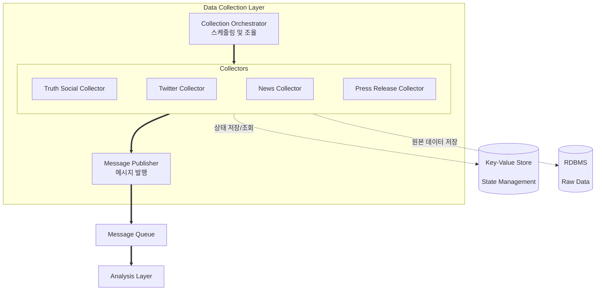

# 데이터 수집 레이어 설계

## 문서 개요

본 문서는 트럼프 스캔 서비스의 데이터 수집 레이어 설계를 다룹니다. 구현 세부사항보다는 전체적인 구조와 개념, 그리고 고려해야 할 사항들을 중심으로 기술합니다.

---

## 1. 레이어 개요

### 1.1 목적

여러 채널에서 트럼프 대통령의 발언을 실시간으로 수집하고 구조화하여 다음 레이어로 전달합니다.

### 1.2 핵심 책임

- 다양한 채널로부터 데이터 수집
- 수집한 데이터를 구조화된 형태로 변환
- 중복 수집 방지 (이미 수집한 데이터 추적)
- 원본 데이터 저장 (재분석 및 감사 목적)
- 다음 레이어(중복 제거)로 데이터 전달

### 1.3 요구사항

**기능 요구사항**:
- 여러 채널 동시 모니터링
- 실시간/준실시간 수집 (5-10분 간격)
- 마지막 수집 지점 추적
- 원본 데이터 영속화

**비기능 요구사항**:
- **확장성**: 새 채널 추가 용이
- **복원력**: 특정 채널 장애가 전체에 영향 없음
- **성능**: 발언 발생 후 5분 이내 수집
- **신뢰성**: 데이터 손실 방지

---

## 2. 아키텍처 구조

### 2.1 전체 구조



**범례:**
- **실선 화살표 (==>)**: 실행 흐름
- **점선 화살표 (-.->)**: 데이터 저장/조회
- **Key-Value Store**: 상태 관리 및 Checkpoint 저장
- **RDBMS**: 원본 데이터 영속화

### 2.2 주요 개념

**Collector**
- 특정 채널에서 데이터를 수집하는 독립적인 단위
- 각 채널마다 하나의 Collector 존재
- 서로 독립적으로 동작하며 실패가 격리됨

**Checkpoint**
- 마지막으로 수집한 데이터의 위치를 나타내는 정보
- 채널별로 다른 형태 (시간, ID, URL 등)
- 시스템 재시작 시 이어서 수집할 수 있게 함

**Orchestrator**
- 여러 Collector의 실행을 조율
- 각 Collector를 정해진 주기로 실행
- 전체 상태 모니터링

---

## 3. 핵심 컴포넌트

### 3.1 Collector (수집기)

**개념**

특정 채널에서 데이터를 가져오는 기능 단위입니다. 각 채널의 특성에 맞게 구현됩니다.

**공통 처리 흐름**
```
1. 마지막 수집 지점(Checkpoint) 조회
2. 새 데이터 수집
   - RSS 파싱, API 호출, 웹 스크래핑 등
3. 원본 데이터 저장
4. Checkpoint 업데이트
5. 메시지 발행 (다음 레이어로)
```

**계획된 Collector 목록**

| 채널 | 수집 방식 | 수집 주기 |
|------|-----------|-----------|
| **Truth Social** | trumpstruth.org RSS | 5분 |
| **News** | 여러 RSS 피드 | 10분 |
| **Press Release** | 백악관 RSS | 15분 |
| Instagram | 향후 추가 | - |
| YouTube | 향후 추가 | - |

**채널별 특성**

*Truth Social (via trumpstruth.org)*
- RSS 피드 제공으로 구현 용이
- 트럼프 계정 전용
- 가장 빠른 업데이트

*News*
- 여러 피드 통합 수집
- 키워드 필터링 필요 ("Trump", "President Trump")

*Press Release*
- 공식 발표문
- 신뢰도 높음
- 업데이트 빈도 낮음

### 3.2 Message Publishing (메시지 발행)

**역할**

수집 완료된 데이터를 다음 레이어(중복 제거)로 전달합니다.

**메시지 구조**

다음 레이어로 전달하는 메시지 형식:
- RawData 객체 전체를 JSON으로 직렬화하여 발행
- 메시지에 자동 포함되는 필드:
  - id: 저장된 데이터의 고유 ID
  - content: 포스트 내용
  - link: 포스트 링크
  - published_at: 발행 시간
  - channel: 채널 이름

### 3.3 Collection Orchestrator (조율자)

**역할**

전체 수집 프로세스를 관리하고 조율합니다.

**주요 기능**
- Collector 등록 및 관리
- 주기적 실행 스케줄링
- 전체 상태 모니터링
- 우아한 시작/종료

**실행 방식**
- 초기화: 각 Collector 및 인프라 컴포넌트 등록
- 즉시 실행: 시작 시 한 번 즉시 실행하여 초기 데이터 수집
- 주기적 실행: APScheduler를 사용하여 설정된 주기로 반복 실행
  - 설정 파일: `config/scheduler.py`에서 주기 관리
  - 기본 주기: 5분 (테스트 시 1분으로 변경 가능)
  - Trigger: interval 방식
- 종료: SIGINT/SIGTERM 시그널 처리를 통한 우아한 종료
  - 진행 중인 작업 완료 대기
  - 리소스 정리 후 종료

---

## 4. 데이터 저장소

### 4.1 Key-Value Store (상태 관리)

**역할**

각 채널별 수집 상태와 Checkpoint를 저장하고 관리합니다. 빠른 읽기/쓰기 성능을 제공하여 실시간 상태 추적을 지원합니다.

**저장 내용**

각 채널별로 다음 정보를 관리합니다:
- 채널 이름
- 체크포인트 정보 (통일된 형태: published_at datetime)
  - 모든 채널: 마지막으로 수집한 데이터의 발행 시간
  - 형식: ISO 8601 datetime (timezone 포함)
- 마지막 수집 시간
- 상태 (성공/실패)
- 연속 에러 횟수

**저장 시점**
- Checkpoint 조회: Collector 시작 시
- Checkpoint 저장: 수집 완료 후
- 상태 업데이트: 매 수집 시도마다

**활용 방안**
1. 마지막 수집 지점부터 이어서 수집
2. 시스템 재시작 시 복구
3. 채널별 상태 모니터링
4. 에러 추적 및 Circuit Breaker 판단

**설계 원칙**
- 원자적 업데이트 (Atomic operations) 보장
- 채널별 독립적인 데이터 관리
- 필요 시 히스토리는 별도 저장소로 관리

### 4.2 RDBMS

**역할**

수집한 원본 데이터를 영속화합니다. 분석 레이어에서 사용하고, 감사 및 재분석에 활용됩니다.

#### 4.2.1 Raw Data 테이블

**저장 내용**

- 고유 ID (자동 생성, Primary Key)
- 포스트 내용
- 포스트 링크
- 발행 시간 (원본 게시 시간)
- 채널
- 생성 시간 (시스템 기록)

**인덱스**

- (id): Primary Key
- (published_at): 발행 시간 기준 조회
- (channel): 채널별 조회
- (created_at): 생성 시간 기준 조회

**저장 시점**

Collector에서 데이터 수집 후 즉시 저장

**활용 방안**

1. 분석 레이어에서 원본 데이터 참조
2. 재분석 및 재처리
3. 감사 추적
4. 통계 및 리포트 생성
5. 데이터 품질 검증

**스키마 설계 원칙**

- INSERT만 수행 (UPDATE 없음)
- 원본 데이터는 불변
- 파티셔닝 고려 (채널별 또는 시간별)

---

## 5. 에러 처리

### 5.1 에러 유형과 대응

**네트워크 에러**
- 증상: 연결 실패, 타임아웃
- 대응: 재시도 (점진적 대기 시간 증가)
- 1차: 10초 후, 2차: 30초 후, 3차: 90초 후

**인증 에러**
- 증상: API 키 만료, 권한 없음
- 대응: 즉시 중단, 관리자 알림

**파싱 에러**
- 증상: RSS/JSON 형식 오류
- 대응: 로그 기록, 다음 주기에 재시도

**예상 못한 에러**
- 증상: 알 수 없는 오류
- 대응: 로그 기록, 관리자 알림, 상황에 따라 중단

### 5.2 재시도 전략

**기본 원칙**
- 일시적 오류는 재시도
- 영구적 오류는 재시도 안 함
- 재시도 간격은 점진적으로 증가 (Exponential Backoff)

**Circuit Breaker**
- 연속 실패가 일정 횟수(예: 5회) 이상이면 일시 중단
- 일정 시간(예: 5분) 후 다시 시도
- 성공하면 정상 상태로 복귀

### 5.3 장애 격리

각 Collector는 독립적으로 동작하므로:
- Truth Social 장애 → Twitter와 News는 정상 동작
- 한 채널의 문제가 전체 시스템에 영향 없음
- 채널별 독립적인 재시작 가능

---

## 6. 모니터링

### 6.1 추적해야 할 메트릭

**수집 상태**
- 각 채널별 마지막 수집 시간
- 각 채널별 성공/실패 횟수
- 수집된 항목 수

**성능**
- 수집 소요 시간
- API 응답 시간
- 데이터 저장 시간

**에러**
- 에러 발생 빈도
- 에러 유형별 통계
- 연속 실패 횟수

### 6.2 알림이 필요한 상황

**즉시 알림**
- 10분 이상 수집 중단
- 연속 3회 이상 실패
- Circuit Breaker 작동
- 인증 실패

**정기 리포트**
- 일일 수집 통계
- 에러 요약
- 성능 추세

### 6.3 모니터링 대시보드

**전체 현황**
- 모든 Collector 상태 한눈에
- 최근 24시간 수집 추이
- 현재 에러 상황

**채널별 상세**
- 수집 통계 (성공률, 평균 항목 수)
- 성능 메트릭 (평균 시간, 95 percentile)
- Checkpoint 정보
- 최근 에러 목록

---

## 7. 확장성 고려사항

### 7.1 새로운 채널 추가

**고려사항**
- 기존 Collector와 같은 처리 흐름 따르기
- 채널별 특성에 맞는 수집 방식 선택
- 적절한 수집 주기 설정

**추가 시 영향 범위**
- 기존 Collector: 영향 없음 (독립적)
- 공통 서비스: 그대로 재사용
- 설정: 새 채널 정보만 추가

### 7.2 처리량 증가 대응

**수직 확장 (Scale Up)**
- 더 강력한 서버 사용
- 메모리, CPU 증가
- 단일 인스턴스 성능 향상

**수평 확장 (Scale Out)**
- 여러 인스턴스 실행
- 채널별로 인스턴스 분산
- 로드 밸런싱

**확장 시 주의사항**
- Checkpoint 공유 (중앙 저장소 사용)
- 중복 실행 방지 (분산 락 고려)
- 메시지 큐 용량 고려

### 7.3 성능 최적화 포인트

**병목 가능 지점**
- RSS 파싱: 여러 피드 순차 처리 → 병렬 처리 고려
- DB 저장: 단건 INSERT → 배치 INSERT 고려
- 메시지 발행: 단건 발행 → 배치 발행 고려

**캐싱 활용**
- Checkpoint 정보 캐싱
- 자주 조회하는 설정 정보 캐싱

---

## 부록: 용어 정의

| 용어 | 설명 |
|------|------|
| **Collector** | 특정 채널에서 데이터를 수집하는 기능 단위 |
| **Checkpoint** | 마지막으로 수집한 데이터의 위치/시간 정보 |
| **Orchestrator** | 여러 Collector를 관리하고 조율하는 컴포넌트 |
| **Raw Data** | 가공되지 않은 원본 수집 데이터 |
| **Circuit Breaker** | 반복 실패 시 요청을 차단하는 패턴 |
| **Backoff** | 재시도 간격을 점진적으로 늘리는 전략 |

---

**문서 끝**