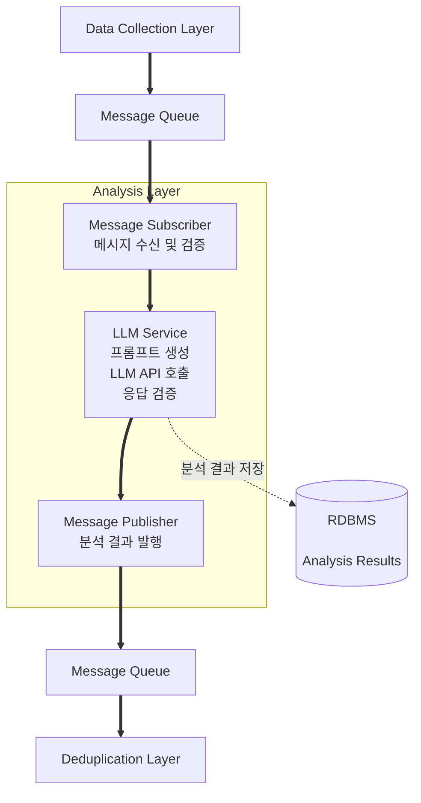

# 분석 레이어 설계

## 문서 개요

본 문서는 트럼프 스캔 서비스의 분석 레이어 설계를 다룹니다. 수집된 원본 데이터를 LLM을 활용하여 가공하고 분석하는 과정과 구조를 중심으로 기술합니다.

---

## 1. 레이어 개요

### 1.1 목적

수집 레이어에서 전달받은 원본 데이터를 LLM으로 분석하여 사용자에게 제공할 수 있는 형태로 가공합니다.

### 1.2 핵심 책임

- 원본 데이터(Raw Data)를 LLM으로 분석
- 중복 제거용 짧은 요약(Semantic Summary) 생성
- 사용자용 한국어 요약(Display Summary) 생성
- 관련 키워드 식별
- 분석 결과 저장
- 다음 레이어(중복 제거)로 데이터 전달

### 1.3 요구사항

**기능 요구사항**:
1. 메시지 큐에서 원본 데이터 수신 (ID + 전체 데이터 포함)
2. LLM 호출 1회로 다음 항목 모두 생성:
   - 중복 제거용 짧은 영어 요약 (Semantic Summary)
   - 사용자용 한국어 요약 (Display Summary)
   - 관련 키워드 목록
3. 분석 결과와 사용된 LLM 모델명을 RDBMS에 저장
4. 분석 완료 메시지를 분석 결과 전체와 함께 다음 레이어로 발행

**비기능 요구사항**:
1. **예상 처리 시간**: 데이터당 10-30초 정도 (LLM 모델에 따라 상이)
2. **출력 형식 일관성**: 프롬프트에 출력 구조를 명시하여 LLM이 정의된 형식을 따르도록 함
3. **비용 효율성**: 한 번의 LLM 호출로 모든 분석 완료하여 API 비용 최소화
4. **복원력**: LLM API 장애나 타임아웃 시 재시도 메커니즘
5. **향후 확장 가능성**: 처리량 증가 시 병렬 처리 가능하도록 설계 고려

---

## 2. 아키텍처 구조



**범례:**
- **실선 화살표 (==>)**: 메시지 흐름
- **점선 화살표 (-.->)**: 데이터 저장

---

## 3. 핵심 컴포넌트

### 3.1 Message Subscriber (메시지 구독자)

**개념**

메시지 큐에서 원본 데이터를 수신하고 처리 가능한 상태인지 검증하는 컴포넌트입니다.

**주요 기능**
- 메시지 큐 연결 및 구독
- 메시지 수신 및 역직렬화
- 메시지 형식 검증
- 유효한 메시지를 LLM Service로 전달
- 무효한 메시지 처리 (로깅, DLQ 이동)

**검증 항목**
- 필수 필드 존재 여부 (ID, content, channel, published_at 등)
- 데이터 타입 확인
- content 필드가 비어있지 않은지 확인

**에러 처리**
- 메시지 파싱 실패: 로그 기록 후 Dead Letter Queue로 이동
- 큐 연결 끊김: 자동 재연결 (지수 백오프)
- 잘못된 메시지 형식: 로그 기록 후 스킵

### 3.2 LLM Service (LLM 서비스)

**역할**

원본 데이터를 LLM으로 분석하여 구조화된 결과를 생성하는 핵심 컴포넌트입니다.

**처리 흐름**
```
1. 원본 데이터 수신
2. 프롬프트 생성 (원본 내용 + 분석 지침 + 출력 형식)
3. LLM API 호출
4. 응답 수신 및 파싱
5. 응답 형식 확인
6. 분석 결과 반환
```

**생성 항목**
- **Semantic Summary**: 중복 제거용 짧은 영어 요약 (100-200 단어)
- **Display Summary**: 사용자용 한국어 요약 (3-5문장)
- **Keywords**: 관련 키워드 목록

**응답 형식 확인**
- JSON 파싱 가능 여부
- 필수 필드 존재 여부 (semantic_summary, display_summary, keywords)
- 각 필드의 데이터 타입 및 길이 검증

**에러 처리**
- API 타임아웃: 최대 3회 재시도 (30초, 60초, 120초 대기)
- Rate Limit 초과: 응답 헤더의 Retry-After 값만큼 대기 후 재시도
- 잘못된 응답 형식: 1회 재시도, 실패 시 에러 로그 및 알림
- API 키 인증 오류: 즉시 중단 및 관리자 알림

**LLM 모델 선택 고려사항**
- 처리 속도 vs 분석 품질
- API 비용
- 한국어 능력
- 출력 형식 준수도

### 3.3 Message Publisher (메시지 발행자)

**역할**

분석 완료된 데이터를 메시지로 포맷하여 다음 레이어(중복 제거)로 전달합니다.

**주요 기능**
- 분석 결과를 메시지 포맷으로 변환
- 메시지 직렬화
- 메시지 큐에 발행
- 발행 성공 확인

**메시지 페이로드 구조**

다음 레이어로 전달하는 메시지에 포함되는 정보:
- 이벤트 타입 (분석 완료)
- 분석 ID
- 원본 데이터 ID
- Semantic Summary (중복 제거용)
- Display Summary (피드용)
- Keywords
- 채널 정보
- 원본 발행 시간
- 분석 완료 시간

**에러 처리**
- 발행 실패: 최대 3회 재시도 (5초, 15초, 45초 간격)
- 재시도 모두 실패: 로그 기록, 알림 발송, 실패 큐 이동
- 큐 연결 끊김: 자동 재연결 시도

---

## 4. 데이터 저장소

### 4.1 RDBMS

**역할**

LLM 분석 결과를 영속화하여 중복 제거, 피드 생성, 감사 목적으로 활용합니다.

#### 4.1.1 Analysis Results 테이블

**저장 내용**

- 분석 ID (자동 생성, Primary Key)
- 원본 데이터 ID (Raw Data Store 참조)
- Semantic Summary (영어, 중복 제거용)
- Display Summary (한국어, 사용자용)
- Keywords (관련 키워드 목록, JSON/Array)
- 사용된 LLM 모델명 (예: gpt-4, claude-3-opus)
- 분석 완료 시간

**인덱스**

- (analysis_id): Primary Key
- (raw_data_id): 원본 데이터 참조용
- (created_at): 시간순 조회 및 통계용
- (model_name): 모델별 통계용

**저장 시점**

LLM Service에서 분석 완료 후 즉시 저장

**활용 방안**

1. 중복 제거 레이어에서 Semantic Summary 사용
2. 피드 생성 레이어에서 Display Summary 사용
3. 모델별 성능 비교 및 분석
4. 감사 추적 및 품질 검증
5. 통계 및 리포트 생성

**스키마 설계 원칙**

- INSERT만 수행 (UPDATE 없음)
- 분석 결과는 불변
- 재분석 필요 시 새 레코드 추가

---

## 5. LLM 분석 프로세스

### 5.1 프롬프트 설계

**구조**

프롬프트는 다음 요소들로 구성됩니다:
- 시스템 메시지: 역할 정의 (트럼프 발언 분석 전문가)
- 분석 지침: 어떤 항목을 생성해야 하는지
- 출력 형식: JSON 구조 예시 제공
- 원본 데이터: 실제 분석할 내용

**고려사항**
- 명확한 지침으로 일관성 확보
- 예시 제공으로 형식 준수
- 한국어 능력 요구사항 명시

### 5.2 출력 구조

각 필드의 상세 설명:

**semantic_summary**
- 길이: 100-200 단어
- 언어: 영어
- 목적: 중복 제거용 임베딩 입력

**display_summary**
- 길이: 3-5 문장
- 언어: 한국어
- 목적: 사용자 피드 표시

**keywords**
- 형태: 배열
- 가능한 값들: 정의된 키워드 목록
- 목적: 피드 필터링 및 분류

### 5.3 품질 검증

**형식 검증**
- JSON 파싱 가능 여부
- 필수 필드 존재
- 데이터 타입 확인

**내용 검증**
- summary가 비어있지 않은지
- keywords가 유효한 값인지
- 길이 제한 준수 여부

**검증 실패 시**
- 1회 재시도
- 재시도 실패 시 에러 처리

---

## 6. 에러 처리

### 6.1 에러 유형과 대응

**LLM API 에러**
- 증상: 타임아웃, Rate Limit, API 키 만료
- 대응: 타임아웃과 Rate Limit은 재시도, API 키 문제는 즉시 중단 및 알림

**메시지 큐 에러**
- 증상: 연결 끊김, 메시지 파싱 실패
- 대응: 연결 재시도, 잘못된 메시지는 DLQ로 이동

**RDBMS 에러**
- 증상: DB 연결 실패, 쓰기 오류
- 대응: 재시도 (지수 백오프), 지속 실패 시 알림

**응답 형식 에러**
- 증상: 잘못된 JSON, 필수 필드 누락
- 대응: 1회 재시도, 실패 시 로그 및 DLQ 이동

### 6.2 재시도 전략

**기본 원칙**
- 일시적 오류는 재시도 (타임아웃, Rate Limit)
- 영구적 오류는 재시도 안 함 (인증 실패, 잘못된 메시지)
- 지수 백오프 적용 (재시도 간격 점진적 증가)

**재시도 횟수**
- LLM API: 최대 3회
- 메시지 발행: 최대 3회
- DB 쓰기: 최대 3회

**재시도 실패 시**
- 로그 기록
- 관리자 알림
- Dead Letter Queue로 이동 (나중에 재처리 가능)

---

## 7. 모니터링

### 7.1 추적해야 할 메트릭

**처리 상태**
- 처리된 메시지 수 (성공/실패)
- LLM API 호출 횟수
- 평균 처리 시간
- 현재 처리 중인 메시지 수

**성능**
- LLM API 응답 시간
- 메시지 처리 소요 시간 (수신부터 발행까지)
- DB 저장 시간

**에러**
- 에러 발생 빈도
- 에러 유형별 통계 (API 에러, 형식 에러, DB 에러 등)
- 재시도 횟수

**비용**
- LLM API 호출 비용
- 일일/월간 비용 추이

### 7.2 알림이 필요한 상황

**즉시 알림**
- LLM API 인증 실패
- 연속 3회 이상 처리 실패
- DB 연결 끊김
- 처리 지연 (5분 이상 대기)

**정기 리포트**
- 일일 처리 통계 (처리량, 성공률)
- 에러 요약
- 비용 리포트
- 성능 추세

---

## 8. 성능 최적화

**병목 가능 지점**
- LLM API 호출 시간 (10-30초, 대부분의 처리 시간 차지)
- DB 저장 시간
- 메시지 직렬화/역직렬화

**최적화 방안**
- LLM API 타임아웃 적절히 설정
- DB 연결 풀 사용
- 효율적인 직렬화 라이브러리 사용

**향후 확장 가능성**
- 처리량 증가 시 여러 인스턴스로 병렬 처리