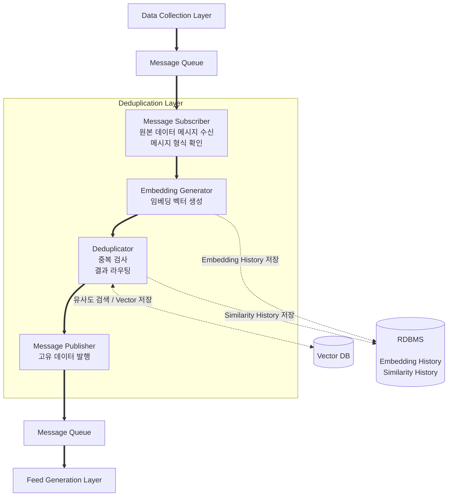

# 중복 제거 레이어 설계

## 문서 개요

본 문서는 트럼프 스캔 서비스의 데이터 중복 제거 레이어 설계를 다룹니다. 구현 세부사항보다는 전체적인 구조와 개념, 그리고 고려해야 할 사항들을 중심으로 기술합니다.

---

## 1. 레이어 개요

### 1.1 목적

여러 채널에서 수집된 데이터 중 유사한 내용을 식별하여 중복을 제거하고, 고유한 발언만 다음 레이어로 전달합니다.

### 1.2 핵심 책임

- 유사 내용 감지 (같은 발언의 다른 표현)
- 최근 데이터와의 비교 (시간 윈도우 내)
- 중복 발견 시 먼저 도착한 것 유지 (순차 처리)
- 중복된 항목 즉시 필터링 (빠른 처리)
- 다음 레이어(분석)로 검증된 데이터만 전달

### 1.3 왜 중복 제거가 중요한가?

**현실적인 시나리오**:
- 트럼프가 Truth Social에 발언 게시
- 뉴스 매체들이 해당 발언을 인용하여 기사 작성
- 결과: 하나의 발언이 여러 채널에서 수집됨

**중복 제거 없이 발생하는 문제**:
- 동일한 발언에 대해 여러 번 분석 수행 (비용 낭비)
- 피드에 같은 내용이 반복 노출 (사용자 경험 저하)
- 불필요한 알림 발생
- 시스템 리소스 낭비

### 1.4 요구사항

**기능 요구사항**:
- 유사도 기반 감지 (텍스트 유사도)
- 시간 윈도우 내 데이터만 비교 (예: 최근 24시간)
- 순차 처리 (먼저 도착한 것 유지)
- 처리 지연 최소화

**비기능 요구사항**:
- **속도**: 중복 체크는 2-3초 이내
- **확장성**: 데이터 증가에 대응 가능
- **신뢰성**: 중복 제거 실패 시에도 데이터는 통과

---

## 2. 아키텍처 구조

### 2.1 전체 구조



**범례:**
- **실선 화살표 (==>)**: 메시지 흐름
- **점선 화살표 (-.->)**: 데이터 저장/검색


### 2.2 주요 개념

**유사 중복 (Near Duplicate)**
- 내용은 같지만 표현이 다른 경우
- 텍스트 유사도 기반 검사
- 예: 뉴스 기사가 발언을 인용하되 약간 수정

**시간 윈도우 (Time Window)**
- 중복 체크를 수행할 시간 범위
- 예: 최근 24시간 내 데이터만 비교
- 오래된 데이터는 중복 체크 제외

**임베딩 벡터 (Embedding Vector)**
- 텍스트를 수치 벡터로 변환한 표현
- 의미가 유사한 텍스트는 유사한 벡터를 가짐
- 일반적으로 256~768차원

---

## 3. 핵심 컴포넌트

### 3.1 Message Subscriber (메시지 구독자)

**역할**

데이터 수집 레이어로부터 원본 데이터가 포함된 메시지를 받아 처리를 시작합니다.

**핵심 책임**
- 메시지 큐에서 메시지 수신
- 메시지 파싱 및 형식 검증
- 페이로드에서 원본 데이터 추출
- Embedding Generator로 전달

**검증 항목**
- 필수 필드 존재 여부 (ID, content, channel, published_at 등)
- 데이터 타입 확인
- content 필드가 비어있지 않은지 확인

**에러 처리**
- 메시지 파싱 실패: Dead Letter Queue로 이동
- 필수 필드 누락: 로그 기록 후 스킵
- 시스템 에러: 메시지를 큐에 반환하여 나중에 재처리

### 3.2 Embedding Generator (임베딩 생성기)

**역할**

텍스트 데이터를 임베딩 벡터로 변환하고, 모든 임베딩을 Embedding History에 즉시 저장합니다.

**처리 흐름**

1. Message Subscriber로부터 원본 데이터 수신
2. 임베딩 모델로 벡터화
3. Embedding History에 저장 (비동기 처리)
4. 임베딩 벡터를 Deduplicator로 전달

**성능 최적화**

- **모델 캐싱**: 모델을 메모리에 로드하여 재사용

**에러 처리**

- 임베딩 생성 실패: 재시도 (최대 3회)
- 최종 실패 시: 데이터를 중복 체크 없이 통과
- 로그 기록 및 알림 발송

**메트릭**
- 임베딩 생성 시간 (평균/p95/p99)

### 3.3 Deduplicator (중복 제거 처리기)

**역할**

Vector Store를 활용하여 기존 데이터와의 유사도를 계산하고 중복 여부를 판정한 후, 판정 결과에 따라 적절한 저장 작업을 수행하고 고유 데이터는 다음 레이어로 전달합니다.

**핵심 원리: Vector DB의 효율적인 1:N 비교**

**문제 상황**
- 새 데이터 1개와 기존 데이터 수천 개를 비교해야 함
- 각각 1:1로 유사도 계산하면 너무 느림 (O(N) 시간 복잡도)

**Vector DB의 해결책**
- 유사도 검색 (Similarity Search) 기능 제공
- 벡터 인덱싱 알고리즘 사용 (HNSW, IVF 등)
- 전체를 다 비교하지 않고 "가까운 벡터들"만 효율적으로 탐색
- O(log N) 시간 복잡도로 빠른 검색

**동작 방식**

1. **임베딩 벡터 수신**: Embedding Generator로부터 전달받음
2. **유사도 검색 쿼리**: Vector Store에 유사도 검색 요청
   - **시간 윈도우**: 최근 24-48시간 내 데이터만
   - **채널 제외**: 같은 채널 데이터 제외 (같은 채널에서는 중복 발생 안 함)
3. **결과 분석**: 가장 높은 유사도 확인
4. **임계값 비교**: 임계값(예: 0.85) 이상이면 중복 판정
5. **Similarity History 저장**: 판정 결과 기록
6. **분기 처리**: 판정 결과에 따라 처리

**처리 경로**

**경로 1: 중복 아님 (Unique)**
1. 임베딩 벡터를 Vector Store에 저장
   - 벡터 + 메타데이터 (데이터 ID, 채널, 타임스탬프)
   - TTL: 48시간 (자동 삭제)
2. Message Publisher 호출
3. 메트릭 기록 (고유 데이터)

**경로 2: 중복임 (Duplicate)**
1. 처리 중단 (발행 안 함)
2. 메트릭 기록 (중복 필터됨)

**Vector Store 저장 전략**

- **저장하는 것**: 고유 데이터의 벡터만
- **저장 안 하는 것**: 중복으로 판정된 데이터의 벡터
- **이유**: Vector Store는 실시간 중복 검사 전용, 크기가 작을수록 검색이 빠름

**처리 시나리오 예시**

1. **처음 본 발언**: Similarity History 기록 → Vector Store 저장 → Message Publisher → 다음 레이어
2. **같은 발언 재등장**: Similarity History 기록 → 처리 중단
3. **48시간 후 재등장**: TTL로 Vector Store에서 삭제됨 → 새 고유 데이터로 처리

**임계값 설정**

유사도 임계값은 중요한 파라미터:
- 너무 낮으면: 다른 내용도 중복으로 판정 (False Positive)
- 너무 높으면: 실제 중복을 놓침 (False Negative)

권장 초기값: 0.85 (이후 실제 데이터로 조정)

**임계값별 특성**:
- 0.95: 매우 엄격 - 거의 동일한 경우만 중복
- 0.85: 권장값 - 의미적으로 유사하면 중복
- 0.75: 느슨함 - 관련 있으면 중복

**성능 최적화**

- 조기 종료 (임계값 이상 발견 시 즉시 중단)
- 필터 최적화: 시간 윈도우와 채널 필터로 검색 범위 최소화
- 벡터 인덱싱: Vector DB의 인덱싱 기능 활용
- 연결 풀 관리: Vector Store 연결 풀 적절히 설정

**메트릭**
- 중복 판정 비율 (고유 vs 중복)
- 유사도 분포 (임계값 조정용)
- 평균 처리 시간

### 3.4 Message Publisher (메시지 발행자)

**역할**

Deduplicator로부터 호출되어 고유 데이터를 다음 레이어(피드 생성)로 발행합니다.

**메시지 페이로드 구조**

다음 레이어로 전달하는 메시지 정보:
- 이벤트 타입 (중복 제거 완료)
- 원본 데이터 ID 및 전체 내용
- 채널 정보
- 발행 시간
- 처리 완료 시간

**에러 처리**

- 메시지 발행 실패: 재시도 (exponential backoff)
- 최종 실패: Dead Letter Queue로 이동
- 로그 기록 및 알림

**메트릭**
- 발행 성공률
- 발행 지연 시간
- 재시도 횟수

---

## 4. 데이터 저장소

### 4.1 Vector DB

**역할**

실시간 유사도 검색을 위한 벡터 전용 데이터베이스입니다.

**저장 내용**

- 임베딩 벡터 (고차원 벡터)
- 메타데이터 (데이터 ID, 채널, 타임스탬프)

**특징**

- **TTL**: 48시간 자동 삭제
- **저장 대상**: 고유 데이터의 벡터만 (중복 데이터는 저장 안 함)
- **검색 성능**: ANN(Approximate Nearest Neighbor) 알고리즘으로 빠른 유사도 검색
- **시간 윈도우**: 최근 24-48시간 데이터만 유지

**왜 고유 데이터만 저장하는가?**

- Vector DB는 검색 전용 → 크기가 작을수록 빠름
- 중복 데이터는 검색 대상이 될 필요 없음
- 비용 절감

**활용**

- Deduplicator에서 유사도 검색
- 중복 판정 후 고유 데이터만 저장

### 4.2 RDBMS

**역할**

모든 데이터를 영구 저장하여 분석, 튜닝, 감사 추적에 활용합니다.

#### 4.2.1 Embedding History 테이블

**저장 내용**

- 데이터 ID
- 임베딩 벡터 (고차원 배열)
- 원본 데이터 참조 ID
- 모델명 및 버전
- 벡터 차원
- 생성 시간

**역할**

모든 데이터(고유 + 중복)의 임베딩을 영구 저장합니다.

**왜 필요한가?**

Vector DB는 TTL 48시간 후 삭제되고 고유 데이터만 저장하므로:
- 장기 분석 불가
- 중복 데이터 임베딩 누락
- 복잡한 쿼리 불가

Embedding History는:
- 모든 임베딩 벡터의 완전한 히스토리 유지
- 임계값 튜닝, 모델 개선 등에 활용
- 채널별 유사도 분포 분석
- 감사 추적

**저장 시점**

Embedding Generator에서 임베딩 생성 즉시 저장 (비동기)

**스키마 설계**

INSERT만 수행 (UPDATE 없음):
- 중복 여부 필드 포함하지 않음
- 중복 정보는 Similarity History에 저장
- 필요 시 JOIN으로 조회

**저장 공간 추정**

- 벡터 (768차원 float): 약 3KB
- 메타데이터: 약 200B
- 레코드당: 약 3.2KB
- 일일 120개: 약 384KB/일
- 연간: 약 140MB

**활용 방안**

1. 임계값 튜닝: 샘플 추출 및 유사도 분석
2. 채널별 패턴 분석
3. False Positive 발견
4. 모델 성능 비교
5. 유사도 분포 분석

#### 4.2.2 Similarity History 테이블

**저장 내용**

- 데이터 ID (현재 처리된 데이터)
- 중복 여부 (boolean)
- 가장 유사한 데이터 ID
- 유사도 점수
- 판정 시간

**역할**

모든 중복 제거 판정 결과를 영구 저장합니다.

**설계 원칙: 항상 유사도 기록**

중복 판정뿐만 아니라 고유 판정에서도 가장 유사했던 데이터와 점수를 함께 기록합니다.

**장점**

- 임계값 경계선 케이스(0.80-0.90) 분석 가능
- 고유/중복 모두의 유사도 분포 파악
- False Negative 가능성 검토 가능
- 단일 테이블로 관리 간편

**예시 데이터**

```
data_id | is_duplicate | most_similar_id | similarity_score
--------|--------------|-----------------|------------------
101     | false        | null            | null              (첫 데이터)
102     | false        | 101             | 0.65              (유사도 낮음)
103     | false        | 101             | 0.84              (경계선!)
104     | true         | 101             | 0.92              (중복 확실)
```

**저장 시점**

Deduplicator에서 중복 판정 후 즉시 저장 (동기)

**활용 방안**

1. 임계값 튜닝: 경계선 케이스 분석으로 최적 임계값 도출
2. 인용 지수 계산: 특정 발언의 중복 횟수 (is_duplicate=true 카운트)
3. 중요도 측정: 많이 중복된 발언 = 여러 채널에서 보도 = 중요
4. 패턴 분석: 시간대별, 채널별 유사도 분포
5. 감사 추적: 모든 판정 근거 보존

**Embedding History와의 관계**

- Embedding History: 모든 임베딩 저장
- Similarity History: 모든 판정 결과 저장
- 조인으로 완전한 정보 조회 가능

---

## 5. 데이터 흐름

### 5.1 정상 처리 흐름

```
1. Message Subscriber
   ↓ (원본 데이터)
2. Embedding Generator
   ├→ Embedding History 저장 (비동기)
   └→ 임베딩 생성
      ↓
3. Deduplicator
   ├→ 중복 검사 (Vector Store 유사도 검색)
   └→ Similarity History 저장
      ↓
4-A. 중복 아님:
   ├→ Vector Store 저장
   └→ Message Publisher → 다음 레이어
   
4-B. 중복임:
   └→ 처리 중단
```

### 5.2 중복 감지 알고리즘

**핵심 개념**

1. 임베딩 벡터 생성 (Embedding Generator)
2. Vector Store에서 유사도 검색
   - 필터: 최근 24시간 & 다른 채널만
3. 임계값 비교 (예: 0.85)
4. 중복 판정

**예시**:
```
텍스트 1: "China must stop unfair trade practices"
텍스트 2: "China should halt unfair trade practices"

→ 의미는 같지만 표현이 다름
→ 임베딩 후 코사인 유사도: 0.92 → 중복 판정
```

**시간 복잡도**: O(log N) - Vector DB의 인덱싱 알고리즘
**공간 복잡도**: O(N * D) - N은 시간 윈도우 내 고유 데이터 개수, D는 벡터 차원

### 5.3 임계값 튜닝

임계값은 실제 데이터로 조정해야 합니다:

**초기 권장값**: 0.85

**조정 방법**:
1. Embedding History와 Similarity History에서 샘플 추출
2. 다양한 임계값으로 시뮬레이션
3. False Positive / False Negative 비율 확인
4. 비즈니스 요구사항에 맞게 조정

**임계값별 특성**:
- 0.95: 매우 엄격 - 거의 동일한 경우만 중복
- 0.85: 권장값 - 의미적으로 유사하면 중복
- 0.75: 느슨함 - 관련 있으면 중복

---

## 6. 에러 처리 및 복구

### 6.1 에러 유형과 대응

**메시지 파싱 실패**
- 증상: 잘못된 메시지 형식, 필수 필드 누락
- 대응: Dead Letter Queue로 이동, 로그 기록

**임베딩 생성 실패 (Embedding Generator)**
- 증상: 모델 로딩 실패, 메모리 부족
- 대응: 재시도 (최대 3회), 실패 시 데이터를 통과시킴
- Fallback: 중복 체크 없이 다음 레이어로 전달

**Embedding History 저장 실패**
- 증상: DB 연결 실패, 디스크 부족
- 대응: 재시도 (최대 3회), 알림 발송
- 처리는 계속 진행 (중단하지 않음)

**Vector Store 접근 실패 (Deduplicator)**
- 증상: Vector DB 다운, 네트워크 문제
- 대응: 재시도 (최대 3회), 실패 시 데이터를 통과시킴
- 중복 체크를 못하더라도 데이터는 전달

**메시지 발행 실패**
- 증상: 메시지 큐 다운
- 대응: 재시도 (exponential backoff)
- Dead Letter Queue로 이동

### 6.2 Fallback 전략

시스템 장애 시에도 서비스는 계속되어야 합니다:

```
Primary: 
  임베딩 기반 유사도 검사

Fallback Level 1 (Vector Store 장애):
  중복 체크 없이 모두 통과
  Embedding History 저장은 계속
  알림 발송
  
Fallback Level 2 (Embedding Generator 장애):
  중복 체크 없이 모두 통과
  알림 발송
  
Fallback Level 3 (Embedding History 장애):
  중복 체크는 계속 (Vector Store 사용)
  알림 발송 + 나중에 재저장
```

### 6.3 데이터 일관성

**원칙**: 데이터 손실보다 중복 허용이 나음

- 확실하지 않으면 통과시킴
- 중복 제거 실패는 치명적이지 않음
- Embedding History 저장 실패도 서비스 중단 사유 아님
- 메트릭으로 추적하여 모니터링

---

## 7. 모니터링

### 7.1 핵심 메트릭

**처리 메트릭**
- 시간당 처리된 메시지 수
- 중복으로 필터링된 비율
- 평균 처리 시간
- 처리 대기 큐 길이

**컴포넌트별 성능 메트릭**
- **Embedding Generator**: 임베딩 생성 시간 (평균/p95/p99)
- **Deduplicator**: Vector Store 조회 시간, 중복 판정 비율

**정확도 관련 메트릭**
- 유사도 분포 (히스토그램)
- 임계값 부근 케이스 수 (0.80-0.90 범위)
- 수동 샘플링을 통한 정확도 검증 (주기적)

**Vector Store 메트릭**
- Vector Store 크기 (벡터 개수)
- 인덱스 조회 속도
- 메모리 사용량

**에러 메트릭**
- 에러 발생 횟수 (컴포넌트별)
- 재시도 횟수
- Fallback 활성화 횟수

### 7.2 알림 조건

**즉시 알림**
- 처리 대기 큐가 1000개 초과
- 에러율이 5% 초과 (컴포넌트별)
- 평균 처리 시간이 5초 초과
- Embedding Generator 장애
- Deduplicator 장애

**경고 알림**
- 중복 필터링 비율 급증 (평소의 2배)
- 유사도 계산 실패 증가

### 7.3 대시보드

**실시간 모니터링**
- 처리량 그래프 (분당)
- 중복 필터링 비율
- 컴포넌트별 처리 시간 추이
- 현재 에러 상태
- 컴포넌트별 상태 (Embedding Generator, Deduplicator, Embedding History)

**통계 및 분석**
- 시간대별 중복 패턴
- 채널별 중복 비율
- 유사도 분포
- 채널별 통과율 (어떤 채널이 자주 먼저 도착하는가)
- 인용 지수 기반 중요도 (가장 많이 중복된 발언 추적)
- 컴포넌트별 병목 분석

---

## 8. 확장성 고려사항

### 8.1 향후 확장 방향

**수평 확장 (Scale Out)**
- 각 컴포넌트(Embedding Generator, Deduplicator)를 독립적으로 확장 가능
- 메시지 큐를 통한 부하 분산

**데이터 증가 대응**
- Vector Store: TTL과 시간 윈도우로 크기 제한
- Embedding History: 파티셔닝, 아카이빙 등 일반 DB 확장 기법 활용

**성능 최적화**
- 모델 캐싱으로 임베딩 생성 속도 개선
- Vector Store 인덱싱 최적화 (HNSW, IVF)
- 비동기 처리로 병목 지점 분리

*MVP 단계에서는 이러한 확장성 고려는 불필요하며, 트래픽이 증가할 때 단계적으로 적용*

---

## 9. 기술 선택 시 고려사항

### 9.1 임베딩 모델

| 모델 | 벡터 차원 | 특징 | 장점 | 단점 | 권장 용도 |
|------|----------|------|------|------|----------|
| **all-MiniLM-L6-v2** | 384 | 경량, 영어 중심 | 빠름, 낮은 리소스 | 다국어 약함 | MVP 시작 |
| **multilingual-e5-small** | 384 | 다국어 지원 | 한영 모두 지원 | 약간 느림 | 한국어 포함 시 |
| **text-embedding-3-small** | 1536 | OpenAI API | 높은 품질, 관리 불필요 | API 비용 | 빠른 프로토타입 |

**MVP 권장**: multilingual-e5-small (한국어 지원 필요)

### 9.2 Vector DB

Vector DB는 임베딩 벡터의 유사도 검색을 빠르게 수행하는 특화된 데이터베이스입니다.

| 옵션 | 타입 | 특징 | 장점 | 단점 | 비용 |
|------|------|------|------|------|------|
| **Pinecone** | 관리형 | SaaS, 쉬운 시작 | 운영 불필요, 빠른 검색 | 종속성, 월 비용 | $70/월~ |
| **Qdrant** | 오픈소스 | 자체 호스팅 가능 | 무료, 유연함, Rust 기반 | 직접 운영 필요 | 서버 비용만 |
| **Milvus** | 오픈소스 | 대규모 프로덕션급 | 성능 우수, 기능 풍부 | 복잡도 높음 | 서버 비용만 |
| **Chroma** | 오픈소스 | 경량, 임베딩 특화 | 매우 간단, Python 친화적 | 소규모 전용 | 무료 |
| **Weaviate** | 오픈소스 | 하이브리드 검색 | 기능 풍부, GraphQL | 복잡도 높음 | 서버 비용만 |
| **pgvector** | PG 확장 | 기존 DB 활용 | 단순, 통합 쉬움 | 대규모 성능 제한 | DB 비용만 |

**MVP 권장**:
- **빠른 시작 + 관리 편함**: Pinecone
- **비용 절감 + 유연성**: Qdrant (Docker로 간단히 시작)
- **초소형 프로토타입**: Chroma (파일 기반도 가능)

### 9.3 RDBMS 데이터베이스

**용도**: 임베딩 장기 보관, 분석, 튜닝

| 옵션 | 배열 지원 | 특징 | 장점 | 단점 | 권장 |
|------|----------|------|------|------|------|
| **PostgreSQL** | ✅ (ARRAY) | 범용 RDBMS | 안정적, 강력한 쿼리, 파티셔닝 | - | ⭐ 추천 |
| **MySQL** | ❌ (JSON) | 범용 RDBMS | 익숙함, 널리 사용 | 배열 타입 없음 | 가능 |
| **MongoDB** | ✅ (Native) | NoSQL | 유연한 스키마 | SQL 없음, 분석 약함 | 비추천 |

**MVP 권장**: PostgreSQL
- 배열 타입으로 벡터 저장 편리
- 파티셔닝, 인덱싱 등 확장 기능 우수
- 관리형 서비스 (AWS RDS, Supabase 등) 활용 가능

Embedding History와 같은 DB 사용 권장:
- 단일 테이블로 관리 간편
- PostgreSQL의 boolean, float 타입 활용
- 인덱스: (is_duplicate, most_similar_id), (data_id), (detected_at)

---

## 10. 중복 이력 기반 인용 지수 활용 (향후 확장)

### 10.1 개념

중복 데이터에 원본 ID를 기록하여, 나중에 "인용 지수"처럼 활용 가능합니다.

```
논문 인용 지수:
  많이 인용된 논문 = 중요한 논문

발언 인용 지수:
  많이 중복된 발언 = 여러 채널에서 보도 = 중요한 발언
```

### 10.2 기본 구조

**Similarity History 조회**로 인용 횟수 계산:
- Similarity History: 모든 판정 결과 저장 (is_duplicate, most_similar_id)
- is_duplicate = true인 행만 필터링
- most_similar_id로 그룹핑하여 중복 횟수 계산

**예시 쿼리:**
```sql
SELECT 
  most_similar_id as original_data_id,
  COUNT(*) as citation_count
FROM similarity_history
WHERE is_duplicate = true
GROUP BY most_similar_id
ORDER BY citation_count DESC
```

### 10.3 활용 예시 (MVP 이후)

1. **피드 표시**: "🔥 5개 채널에서 보도"
2. **중요도 점수**: 인용 횟수로 가중치 부여
3. **푸시 알림**: 3개 이상 중복 시 알림
4. **통계**: 가장 많이 보도된 발언 TOP 10

### 10.4 장점

- 원본 데이터 변경 불필요 (단순함)
- 유연한 집계 (다양한 쿼리 가능)
- 원본 삭제되어도 참조 유지
- Embedding History와 분리되어 스키마 단순

**참고**: MVP에서는 중복 이력만 기록하고, 인용 지수 활용은 이후 단계에서 구현

---

## 부록: 용어 정의

| 용어 | 설명 |
|------|------|
| **HNSW** | Hierarchical Navigable Small World - Vector Store의 인덱싱 알고리즘, 빠른 검색 성능 |
| **IVF** | Inverted File Index - Vector Store의 인덱싱 알고리즘, 메모리 효율적 |
| **TTL** | Time To Live - 일정 시간 후 자동 삭제되는 설정 (예: 48시간) |
| **Time Window** | 중복 체크를 수행할 시간 범위 (예: 24-48시간) |
| **Similarity Threshold** | 중복으로 판정하는 유사도 기준값 (예: 0.85) |
| **False Positive** | 중복이 아닌데 중복으로 잘못 판정하는 경우 |
| **False Negative** | 중복인데 중복이 아니라고 잘못 판정하는 경우 |

---

**문서 끝**