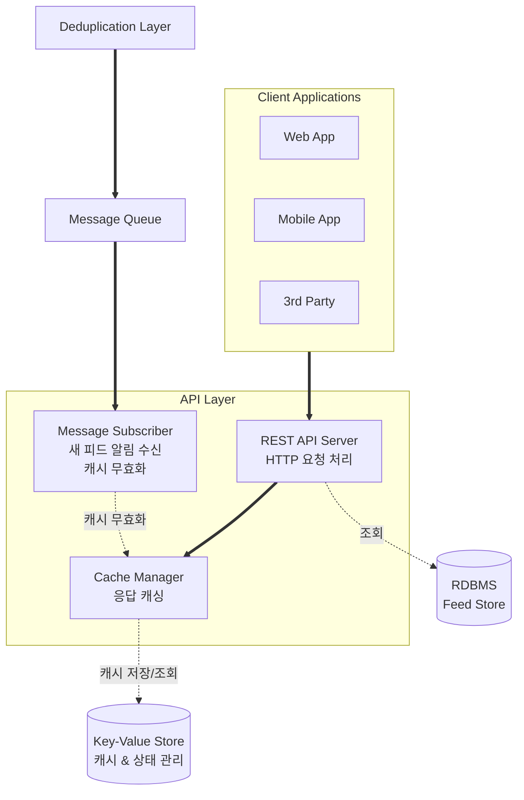

# API 레이어 설계

## 문서 개요

본 문서는 트럼프 스캔 서비스의 API 레이어 설계를 다룹니다. 피드 데이터를 클라이언트에게 제공하는 REST API와 새 피드 확인을 위한 폴링 메커니즘을 중심으로 기술합니다.

---

## 1. 레이어 개요
### 1.1 목적

중복 제거 레이어에서 저장된 피드 데이터를 다양한 클라이언트 애플리케이션(웹, 모바일)에 제공합니다. 기존 피드 데이터를 조회할 수 있는 API와 새로운 피드 존재 여부를 확인할 수 있는 폴링 API를 제공합니다.

### 1.2 핵심 책임

- 피드 데이터 조회 API 제공
- 새 피드 존재 여부 확인 API 제공 (폴링용)
- 산업별/채널별 필터링
- 최신순 정렬
- 페이지네이션을 통한 대용량 데이터 처리
- 응답 캐싱을 통한 성능 최적화
- API 사용 현황 추적 및 Rate Limiting

### 1.3 요구사항

**기능 요구사항**:
- RESTful API로 피드 데이터 제공
- 새 피드 존재 여부 확인 API 제공
- 다양한 필터링 옵션 (산업, 채널, 시간 범위)
- 최신순 정렬
- 페이지네이션

**비기능 요구사항**:
- **응답 속도**: API 응답 100ms 이내 (캐시 히트 시)
- **폴링 응답**: 새 피드 확인 API는 50ms 이내
- **동시 접속**: 최소 1,000개 동시 요청 처리
- **가용성**: 99.9% 이상 가동률
- **확장성**: 트래픽 증가에 따른 수평 확장 가능

---

## 2. 아키텍처 구조

**범례:**
- **실선 화살표 (==>)**: 메시지/요청 흐름
- **점선 화살표 (-.->)**: 데이터 저장/조회

---

## 3. 핵심 컴포넌트
### 3.1 REST API Server

**역할**
HTTP 요청을 받아 피드 데이터를 조회하고 JSON 형태로 응답을 반환하는 메인 API 서버입니다.

**주요 기능**
- HTTP 요청 라우팅 및 파라미터 검증
- Cache Manager를 통한 캐시 확인
- 캐시 미스 시 RDBMS에서 피드 데이터 조회
- 필터링 (산업, 채널, 시간 범위) 적용
- 페이지네이션 처리
- JSON 응답 포맷팅

**처리 흐름**
1. HTTP 요청 수신 및 파라미터 파싱
2. 유효성 검증 (날짜 형식, 산업 코드 등)
3. Cache Manager에 캐시 조회 요청
4. 캐시 히트 시 즉시 응답
5. 캐시 미스 시 DB 쿼리 실행
6. 결과를 Cache Manager에 저장
7. JSON 응답 반환

### 3.2 Cache Manager

**역할**
API 응답을 캐싱하여 반복 요청에 대한 성능을 최적화하고 DB 부하를 감소시킵니다.

**주요 기능**
- 쿼리 파라미터 기반 캐시 키 생성
- Key-Value Store에 응답 데이터 저장
- TTL 기반 자동 만료 (기본 5분)
- 새 피드 생성 시 관련 캐시 무효화
- 캐시 히트율 추적

**캐시 키 전략**
- 피드 목록: `feeds:list:{filters}:{page}`
- 개별 피드: `feeds:item:{id}`
- 최신 인덱스: `feeds:latest_index`
- 필터 해시: 산업, 채널, 시간 범위를 조합하여 생성

**캐시 무효화**
- Message Subscriber로부터 무효화 요청 수신
- 새 피드와 관련된 모든 목록 캐시 삭제
- 최신 인덱스 캐시 업데이트
- 개별 피드 캐시는 TTL로만 만료

### 3.3 Message Subscriber

**역할**
중복 제거 레이어로부터 새 피드 생성 알림을 수신하여 캐시를 무효화합니다.

**주요 기능**
- 메시지 큐 구독 및 연결 유지
- 새 피드 메시지 수신 및 파싱
- 메시지 유효성 검증
- Cache Manager에 캐시 무효화 요청
- 처리 완료 확인 (ACK)

**처리 흐름**
1. 메시지 큐에서 새 피드 알림 수신
2. 메시지 역직렬화 및 검증
3. Cache Manager에 캐시 무효화 요청
4. 최신 인덱스 정보 업데이트
5. 메시지 처리 완료 확인

---

## 4. 클라이언트 인터페이스

**제공 API**
- 피드 목록 조회 (필터링, 페이지네이션 포함)
- 특정 피드 상세 조회
- 새 피드 존재 여부 확인 (새 피드 존재 여부, 최신 피드 인덱스 포함)
- 지원 산업 목록 조회
- 지원 채널 목록 조회

**조회 옵션**
- 산업별 필터링
- 채널별 필터링
- 시간 범위 필터링
- 커서 기반 페이지네이션
- 최신순 정렬 (기본값)

---

## 5. 데이터 저장소

### 5.1 RDBMS (읽기 전용)

**역할**
중복 제거 레이어에서 저장한 피드 데이터를 조회합니다.

**접근 테이블**
- Feed Items: 피드 기본 정보
- Feed Industries: 피드-산업 매핑 정보

**접근 방식**
- 읽기 전용 (SELECT만 수행)
- JOIN을 통한 산업 정보 조회
- 인덱스를 활용한 빠른 조회

### 5.2 Key-Value Store

**역할**
캐시 데이터와 최신 피드 인덱스를 관리합니다.

**저장 내용**
- API 응답 캐시 데이터
- 최신 피드 인덱스
- API 사용 통계 및 메트릭
- Rate Limiting 카운터

---

## 6. 보안 및 인증

**접근 제한 정책**
- 우리 서비스의 공식 클라이언트(웹, 앱)만 접근 허용 목표
- 외부 서비스나 봇의 접근 최대한 차단
- MVP 단계에서는 인증 없이 접근 가능하되, 보호 장치 적용

**MVP 단계 보호**
- CORS 설정: 우리 도메인만 허용
- User-Agent 검증: 정상 브라우저/앱 확인
- 기본 Rate Limiting: IP당 분당 60회, 시간당 1000회

**향후 강화 방안**
- API Key 기반 인증 도입
- API Key + Referer 조합 검증
- 동적 토큰 시스템 (단기 유효 토큰)
- 비정상 패턴 감지 및 자동 차단
- Rate Limiting 정책 세분화
- 민감한 관리 기능은 별도 인증 필요

---

## 7. 모니터링

### 7.1 추적해야 할 메트릭

**API 성능**
- 평균 응답 시간 (P50, P95, P99)
- 처리량 (초당 요청 수)
- 캐시 히트율
- DB 쿼리 시간

**폴링 API**
- 폴링 요청 빈도
- 평균 응답 시간
- 새 피드 감지율

**에러 추적**
- HTTP 상태 코드별 응답 수
- 에러 발생 빈도
- 에러 유형별 통계

### 7.2 알림이 필요한 상황

**즉시 알림 (Critical)**
- API 서버 응답 없음
- 응답 시간 3초 초과
- 에러율 10% 초과
- DB 연결 실패
- 메시지 큐 연결 끊김

**경고 알림 (Warning)**
- 응답 시간 1초 초과
- 캐시 히트율 50% 미만
- 에러율 5% 초과

---

## 8. 성능 최적화

### 8.1 응답 시간 최적화

**캐싱 활용**
- 자주 요청되는 피드 목록 캐싱
- 캐시 키를 쿼리 파라미터로 세분화
- 캐시 워밍: 첫 페이지는 미리 캐싱
- 최신 인덱스 캐싱으로 폴링 API 고속화

**쿼리 최적화**
- 필요한 컬럼만 SELECT
- 적절한 인덱스 활용
- N+1 쿼리 문제 방지 (JOIN 사용)

**비동기 처리**
- 캐시 무효화 작업 백그라운드 처리

### 8.2 처리량 향상

**연결 관리**
- DB 커넥션 풀 사용
- 적절한 풀 크기 설정 (기본 10-20개)
- 유휴 연결 타임아웃 설정

**페이지네이션 최적화**
- 커서 기반으로 오프셋 스캔 방지
- 페이지 크기 제한 (최대 100개)
- 무한 스크롤용 경량 응답 제공

**리소스 효율화**
- JSON 응답 압축 (gzip)
- 불필요한 데이터 필드 제거
- Keep-Alive로 TCP 연결 재사용

---

## 9. 클라이언트 고려사항

### 9.1 클라이언트 구현 가이드

**초기 로드 전략**
- REST API로 첫 페이지 데이터 조회
- 현재 최신 인덱스 저장
- 폴링 시작하여 새 피드 확인
- 오프라인 상태 처리 방안 구현

**폴링 구현**
- 주기적으로 새 피드 확인 API 호출 (예: 30초~1분)
- `has_new: true` 응답 시 폴링 중단
- UI에 "새 피드 N개" 알림 표시
- 사용자 액션 시 새 피드 로드
- 로드 완료 후 최신 인덱스 업데이트 및 폴링 재개

**무한 스크롤 구현**
- 커서 기반 페이지네이션 활용
- 스크롤 위치 감지하여 다음 페이지 자동 로드
- 로딩 인디케이터 표시
- 중복 요청 방지 (이미 로딩 중일 때)

### 9.2 클라이언트 캐싱

**로컬 캐싱 고려사항**
- 이미 조회한 피드 로컬 저장
- 새 피드 로드 시 로컬 캐시 업데이트
- 캐시 만료 정책 설정

**상태 관리**
- 피드 목록 상태
- 필터 상태
- 현재 최신 인덱스
- 폴링 상태 (활성/비활성)
- 새 피드 알림 상태
- 로딩/에러 상태

---

## 10. 확장성 고려사항

### 10.1 트래픽 증가 대응

**수평 확장 (Scale Out)**
- API 서버 인스턴스 추가
- 로드 밸런서로 트래픽 분산
- Stateless 설계로 어느 인스턴스든 요청 처리 가능

**캐시 확장**
- Key-Value Store 용량 증설
- 캐시 전략 고도화 (자주 요청되는 패턴 분석)
- TTL 조정으로 캐시 효율 개선

**DB 최적화**
- 읽기 전용 복제본 추가 (필요 시)
- 쿼리 성능 튜닝
- 인덱스 추가 최적화

### 10.2 기능 확장

**API 버저닝**
- URL 경로에 버전 포함 (예: /v1/feeds)
- 하위 호환성 유지
- Deprecation 정책 수립

**새로운 기능 추가 시**
- 기존 API 구조 유지
- 선택적 파라미터로 확장
- Feature Toggle로 점진적 롤아웃

---

**문서 끝**