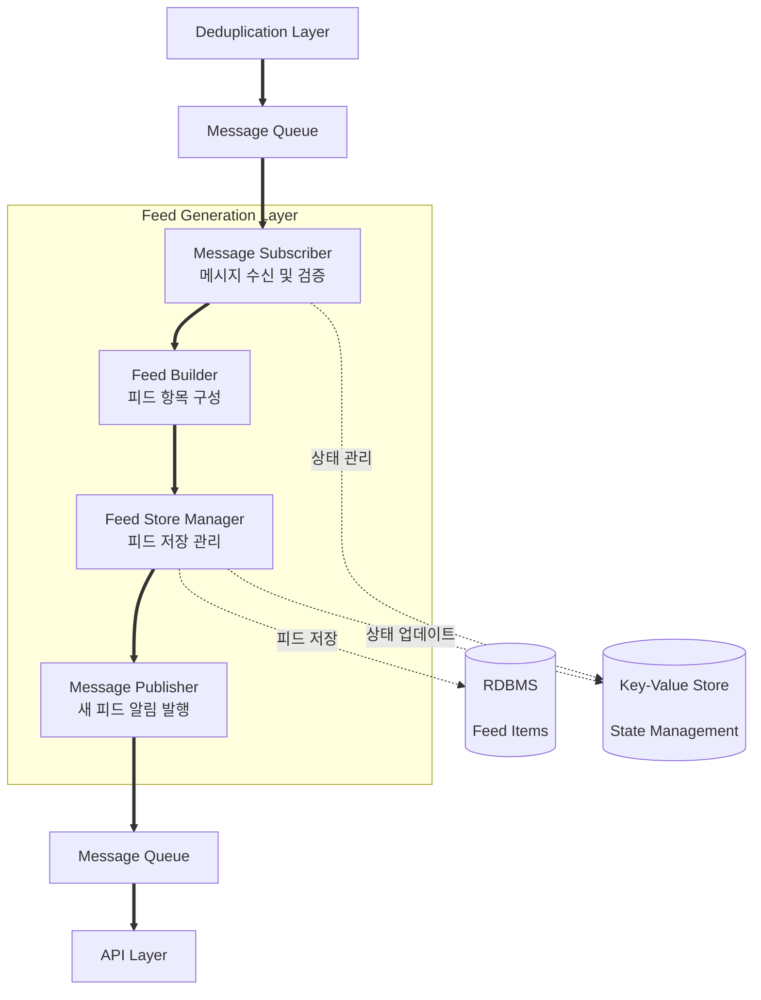

# 피드 생성 레이어 설계

## 문서 개요

본 문서는 트럼프 스캔 서비스의 피드 생성 레이어 설계를 다룹니다. 중복 제거를 통과한 분석 데이터를 사용자에게 제공할 피드 형태로 변환하고 저장하는 과정을 중심으로 기술합니다.

---

## 1. 레이어 개요

### 1.1 목적

중복 제거를 통과한 분석 데이터를 받아서 사용자가 실제로 소비할 수 있는 피드 항목으로 변환하고 저장합니다. API 레이어가 조회할 수 있도록 구조화된 피드 데이터를 생성하는 것이 핵심 목적입니다.

### 1.2 핵심 책임

- 중복 제거 레이어로부터 검증된 분석 데이터 수신
- 분석 데이터를 피드 항목으로 변환 (요약, 산업 태그, 원문 링크, 메타데이터 포함)
- 피드 항목을 RDBMS에 저장
- 새 피드 생성 메시지를 메시지 큐로 발행 (API 레이어가 실시간 전달)
- 피드 ID 생성 및 관리

### 1.3 요구사항

**기능 요구사항**:
- 분석 데이터의 모든 정보를 보존하여 피드로 변환
- 시간순 정렬이 가능하도록 타임스탬프 관리
- 산업별 태그 정보 포함
- 원본 링크 및 채널 정보 보존
- 피드 생성 완료 시 메시지 발행

**비기능 요구사항**:
- 처리 시간: 5초 이내 (수신→저장→발행)
- 데이터 무결성: 트랜잭션으로 저장 보장
- 확장성: 처리량 증가 시 수평 확장 가능
- 신뢰성: 메시지 손실 방지, 실패 시 재처리 가능

---

## 2. 아키텍처 구조

### 2.1 전체 구조

**범례:**
- **실선 화살표 (==>)**: 메시지/처리 흐름
- **점선 화살표 (-.->)**: 데이터 저장/조회

### 2.2 주요 개념

**Feed Item (피드 항목)**
- API 레이어에서 조회할 수 있는 최종 데이터 단위
- 분석 데이터 + 메타데이터로 구성
- 고유 ID를 가지며 시간순 정렬 가능

**Feed Store**
- 피드 항목을 저장하는 RDBMS 테이블
- 인덱싱으로 빠른 조회 지원
- 트랜잭션으로 데이터 무결성 보장

**State Management**
- 현재 처리 중인 항목 추적
- 처리 성공/실패 통계
- 마지막 처리 시간 기록

**Message Flow**
- 입력: 중복 제거 레이어에서 검증된 분석 데이터
- 출력: API 레이어로 새 피드 생성 알림

---

## 3. 핵심 컴포넌트

### 3.1 Message Subscriber (메시지 구독자)

**역할**

중복 제거 레이어로부터 검증된 분석 데이터를 수신하고 처리 가능 상태인지 검증합니다.

**주요 기능**
- 메시지 큐 연결 및 구독
- 메시지 수신 및 역직렬화
- 메시지 형식 검증 (필수 정보 확인)
- 상태 관리: 수신 시작 기록
- 유효한 메시지를 Feed Builder로 전달

**검증 항목**
- 분석 데이터 식별자 존재 여부
- 한국어 요약이 비어있지 않은지
- 산업 분류 정보 형식 확인
- 채널 정보 유효성

### 3.2 Feed Builder (피드 생성기)

**역할**

분석 데이터를 사용자용 피드 항목으로 변환합니다.

**주요 기능**
- 피드 고유 식별자 생성
- 분석 데이터의 모든 정보를 피드 구조로 변환
- 피드 생성 시간 기록
- 피드 항목 객체 구성

**생성 정보**
- 피드 고유 식별자
- 원본 분석 데이터 참조
- 한국어 요약
- 관련 산업 목록
- 채널 정보
- 원본 링크
- 원본 발행 시간
- 피드 생성 시간

### 3.3 Feed Store Manager (피드 저장 관리자)

**역할**

피드 항목을 RDBMS에 안전하게 저장합니다.

**주요 기능**
- 데이터베이스 연결 관리
- 트랜잭션 처리
- 피드 항목 저장
- 저장 성공/실패 상태 업데이트
- 저장 완료 후 다음 컴포넌트로 전달

**트랜잭션 범위**
- 단일 피드 항목 저장을 하나의 트랜잭션으로 처리
- 실패 시 롤백하여 부분 저장 방지

### 3.4 Message Publisher (메시지 발행자)

**역할**

새 피드 생성을 API 레이어에 알림합니다.

**주요 기능**
- 피드 생성 완료 메시지 구성
- 메시지 직렬화
- 메시지 큐에 발행
- 발행 성공 확인
- 상태 관리: 처리 완료 기록

**메시지 내용 (Full 페이로드)**
- 이벤트 타입 (피드 생성됨)
- 피드 식별자
- 분석 데이터 식별자
- 한국어 요약 전체
- 관련 산업 목록
- 채널 정보
- 원본 링크
- 원본 발행 시간
- 피드 생성 시간
- 기타 메타데이터

Full 페이로드를 사용함으로써 API 레이어는 DB 조회 없이 바로 클라이언트에게 실시간 전송이 가능합니다.

---

## 4. 데이터 저장소

### 4.1 RDBMS

**역할**

피드 항목을 영구 저장하여 API 레이어의 조회 요청에 응답할 수 있도록 합니다. 모든 피드 데이터의 중앙 저장소 역할을 수행합니다.

#### 4.1.1 Feed Items 테이블

**저장 내용**

- 피드 고유 식별자 (자동 생성)
- 분석 데이터 참조 (분석 레이어 결과 연결)
- 한국어 요약
- 채널 정보
- 원본 링크
- 원본 발행 시간
- 피드 생성 시간

**Feed Industries 매핑 테이블**

- 피드 식별자 (Feed Items 참조)
- 산업명
- 복합 기본키: (피드 식별자, 산업명)

**저장 시점**

Feed Store Manager에서 트랜잭션으로 두 테이블 동시 저장:
1. Feed Items 테이블에 피드 기본 정보 저장
2. Feed Industries 테이블에 산업 매핑 정보 저장 (산업별로 여러 행)

**활용 방안**

1. API 레이어의 피드 목록 조회 (JOIN 사용)
2. 시간 범위별 피드 조회
3. 산업별 필터링 조회 (매핑 테이블 활용)
4. 채널별 피드 조회
5. 산업별 통계 (가장 많이 언급되는 산업 등)

#### 4.1.2 인덱싱 전략

**Feed Items 테이블 인덱스**

- 피드 식별자: Primary Key로 빠른 단일 조회
- 생성 시간: 시간순 정렬 및 범위 조회
- 원본 발행 시간: 실제 발언 시간 기준 조회
- (생성 시간, 채널): 채널별 최신 피드 조회

**Feed Industries 테이블 인덱스**

- (피드 식별자, 산업명): Primary Key
- (산업명, 피드 식별자): 산업별 피드 목록 조회 최적화

**고려사항**

- 쓰기보다 읽기가 많을 것으로 예상
- 최신 데이터 조회가 가장 빈번
- 산업별 필터링 시 매핑 테이블 인덱스 활용으로 성능 확보
- JOIN 비용은 있지만 정규화로 얻는 이점이 더 큼

---

## 5. 피드 구성 프로세스

**기본 정보**
- 피드 고유 식별자: 시스템에서 자동 생성
- 분석 참조: 원본 분석 데이터와의 연결

**콘텐츠 정보**
- 한국어 요약: 사용자가 읽을 핵심 내용 (3-5 문장)
- 관련 산업 목록: 영향받는 산업 분류
- 원본 링크: 실제 발언이 게시된 URL
- 채널 정보: 어느 플랫폼에서 수집했는지 (Truth Social, 뉴스 등)
- 원본 발행 시간: 트럼프가 실제로 발언한 시간

**시스템 정보**
- 피드 생성 시간: 이 레이어에서 피드로 만든 시간 (정렬 기준)

---

## 6. 에러 처리

### 6.1 에러 유형과 대응

**메시지 처리 에러**
- 증상: 메시지 파싱 실패, 필수 필드 누락
- 대응: 로그 기록 후 Dead Letter Queue로 이동, 다음 메시지 처리 계속

**데이터베이스 에러**
- 증상: 연결 실패, 트랜잭션 실패, 제약 조건 위반
- 대응:
    - 연결 실패: 재연결 시도 (최대 3회)
    - 트랜잭션 실패: 롤백 후 재시도
    - 제약 조건 위반: 로그 기록, 관리자 알림

**메시지 발행 에러**
- 증상: 메시지 큐 연결 끊김, 발행 실패
- 대응: 재시도 (지수 백오프), 임시 로컬 큐에 보관

### 6.2 재시도 전략

**재시도 대상**
- 데이터베이스 일시적 연결 실패
- 메시지 큐 일시적 연결 실패
- 네트워크 타임아웃

**재시도 하지 않는 경우**
- 메시지 형식 오류
- 필수 데이터 누락
- 제약 조건 위반 (중복 키 등)

**재시도 간격**
- 1차: 1초 후
- 2차: 3초 후
- 3차: 10초 후
- 3회 실패 시 포기하고 에러 처리

### 6.3 장애 격리

**격리 원칙**
- 하나의 메시지 처리 실패가 전체 파이프라인을 멈추지 않음
- 문제 있는 메시지는 격리하여 별도 처리
- 데이터베이스 장애 시에도 메시지는 큐에 보관되어 손실 방지

**Dead Letter Queue 활용**
- 처리 불가능한 메시지 격리
- 나중에 수동으로 재처리 가능
- 문제 분석용 데이터 보존

---

## 7. 모니터링

### 7.1 추적해야 할 메트릭

**처리 상태**
- 처리된 피드 수 (시간별, 일별)
- 성공/실패 비율
- 평균 처리 시간 (메시지 수신 → 발행 완료)
- 현재 큐에 대기 중인 메시지 수
- 마지막 처리 완료 시간

### 7.2 알림이 필요한 상황

**즉시 알림 (Critical)**
- 데이터베이스 연결 실패
- 메시지 큐 연결 끊김
- 연속 5회 이상 처리 실패
- Dead Letter Queue에 메시지 5개 이상 쌓임

**경고 알림 (Warning)**
- 처리 시간이 5초 초과
- 에러율 5% 초과
- 큐 대기 메시지 100개 초과

---

## 8. 성능 및 확장성

### 8.1 확장 고려사항

**수평 확장 (Scale Out)**
- 여러 인스턴스로 병렬 처리 가능
- 메시지 큐가 자연스럽게 로드 밸런싱
- 주의: 동시에 같은 메시지 처리하지 않도록 설정

**병목 지점 예상**
- 데이터베이스 쓰기가 주요 병목
- 해결책:
    - DB 쓰기 성능 개선 (SSD, 메모리 증설)
    - 읽기 전용 복제본 추가 (API 레이어용)

**향후 고려사항**
- 트래픽 증가 시 인스턴스 자동 스케일링
- 피드 아카이빙 정책 수립 (오래된 데이터 별도 저장)

---

**문서 끝**